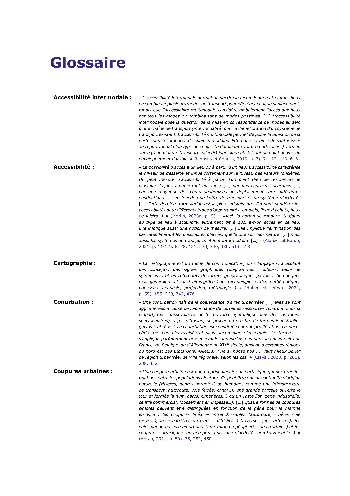
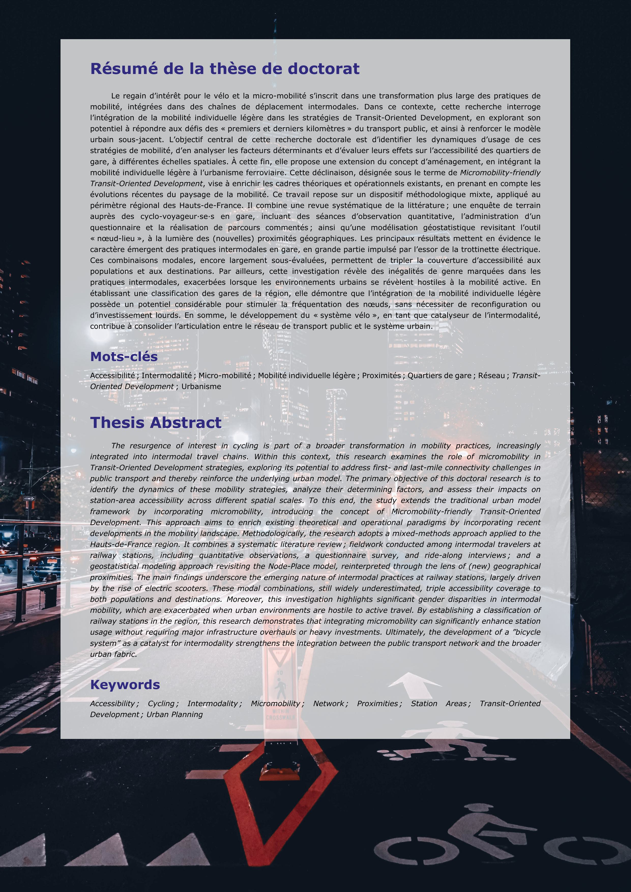

# Improved Gustave Eiffel University (French) PhD Thesis Template - *LaTeX*

This *GitHub* repository contains the *LaTeX* source files for my submitted PhD thesis (*Version 1*).

## Repository Structure :file_folder:
The repository is organized as follows:

* `main.tex` :arrow_right: The main *LaTeX* file that compiles the full thesis.

### Style and Formatting Files :art:
* `JMR.sty`, `main-local.sty`, `UGE/UGE-Thesis.sty`, and `UGE/UGE-Template.sty` :arrow_right: *LaTeX* style files and document structuring settings.
* `UGE/UGE-Bib.sty`, `UGE/UGE-Col.sty`, and `UGE-Fontes.sty` :arrow_right: Custom *LaTeX* styles for bibliography, colors, and fonts.

### Bibliography :open_book:
* `DM.bib` :arrow_right: The bibliography file containing all references.

### Thesis Content :black_nib:
* `body.tex` :arrow_right: The main structure of the thesis body.
* `src/Corps` :arrow_right: Contains all primary content, including parts, chapters, appendices, and additional sections.
* `src/Figures` :arrow_right: Stores figures, diagrams, and maps, organized per chapter.
* `src/Tableaux` :arrow_right: Contains tables, organized per chapter.

## Compilation Instructions :computer:
To compile the manuscript, choose one of the following methods:

### Local compilation with `latexmk` and *LuaLaTeX*

If using a local *LaTeX* editor, run the following command:

```sh
latexmk -pvc -quiet main.tex
```

After five compilation iterations, the final PDF version of the thesis will be generated.

### Using Compilation with *Overleaf*

You can also use *Overleaf* to compile the thesis. However, due to the large size of the document, full compilation may exceed Overleaf's timeout limits.
To compile specific sections separately, uncomment the relevant line(s) in `main.tex`:

```sh
%\includeonly{src/Corps/0-Introduction-generale}
%\includeonly{src/Corps/Chap-1-Cadre-theorique}
%\includeonly{src/Corps/Chap-2-Revue-systematique}
%\includeonly{src/Corps/Chap-3-Methodologie}
%\includeonly{src/Corps/Chap-4-Profil-voyageurs}
%\includeonly{src/Corps/Chap-5-Distances-detours}
%\includeonly{src/Corps/Chap-6-Modelisation-NPART}
%\includeonly{src/Corps/0-Conclusion-generale}
%\includeonly{src/Corps/0-Annexes}
```
This allows you to compile only a selected chapter instead of the entire thesis.

## Dependencies
Ensure that the following *LaTeX* packages are installed and updated:

| Page Layout & Structure | Mathematics & Symbols | Content & Indexing | Tables & Figures | Fonts & Formatting |
|--------------------------|----------------------|---------------------|------------------|--------------------|
| `adjustbox` | `amsmath` | `biblatex` | `booktabs` | `draftwatermark` |
| `afterpage` | `amssymb` | `csquotes` | `caption` | `eurosym` |
| `atbegshi` | `arydshln` | `etoc` | `colortbl` | `fancyhdr` |
| `boxedminipage` | `mathtools` | `etoolbox` | `eso-pic` | `fontspec` |
| `chngcntr` | `pifont` | `footmisc` | `float` | `graphicx` |
| `geometry` | `siunitx` | `glossaries` | `floatrow` | `helvet` |
| `longtable` | `xfrac` | `idxlayout` | `multirow` | `hyperref` |
| `newfloat` | | `imakeidx` | `subcaption` | `lipsum` |
| `parskip` | | `makeidx` | `tabularray` | `lastpage` |
| `sectsty` | | `nameref` | `tabularx` | `lettrine` |
| `titlesec` | | `refcount` | `tikz` | `menukeys` |
| `tocloft` | | | `xcolor` | `nowidow` |
| `truncate` | | | | `ragged2e` |
| `wrapfig` | | | | `relsize` |
| | | | | `silence` |
| | | | | `subfiles` |
| | | | | `verse` |
| | | | | `vertabim` |
| | | | | `xpatch` |

If using *TeX Live* or *MiKTeX*, all required packages can be installed via package managers.

## Style :microscope:

A selection of examples showcasing the structure and style of this extensive 762-page thesis:

<table style="width: 100%;">
  <tbody>
    <tr>
      <td align="center" valign="top" style="width: 33%;">
        
        <br />
        <sub><b>Front Page</b></sub>
      </td>
      <td align="center" valign="top" style="width: 33%;">
        
        <br />
        <sub><b>Reading Guide</b></sub>
      </td>
      <td align="center" valign="top" style="width: 33%;">
        
        <br />
        <sub><b>Acknowledgement</b></sub>
      </td>
    </tr>
  </tbody>
</table>

<table style="width: 100%;">
  <tbody>
    <tr>
      <td align="center" valign="top" style="width: 33%;">
        
        <br />
        <sub><b>Table of Contents</b></sub>
      </td>
      <td align="center" valign="top" style="width: 33%;">
        
        <br />
        <sub><b>Table of Figures</b></sub>
      </td>
      <td align="center" valign="top" style="width: 33%;">
        
        <br />
        <sub><b>Table of Maps</b></sub>
      </td>
    </tr>
  </tbody>
</table>

<table style="width: 100%;">
  <tbody>
    <tr>
      <td align="center" valign="top" style="width: 33%;">
        
        <br />
        <sub><b>Table of Tables</b></sub>
      </td>
      <td align="center" valign="top" style="width: 33%;">
        
        <br />
        <sub><b>Foreword</b></sub>
      </td>
      <td align="center" valign="top" style="width: 33%;">
        
        <br />
        <sub><b>Captatio Benevolentiae</b></sub>
      </td>
    </tr>
  </tbody>
</table>

<table style="width: 100%;">
  <tbody>
    <tr>
      <td align="center" valign="top" style="width: 33%;">
        
        <br />
        <sub><b>Introduction</b></sub>
      </td>
      <td align="center" valign="top" style="width: 33%;">
        
        <br />
        <sub><b>Parts</b></sub>
      </td>
      <td align="center" valign="top" style="width: 33%;">
        
        <br />
        <sub><b>Chapters</b></sub>
      </td>
    </tr>
  </tbody>
</table>

<table style="width: 100%;">
  <tbody>
    <tr>
      <td align="center" valign="top" style="width: 33%;">
        
        <br />
        <sub><b>Chapter Table of Contents</b></sub>
      </td>
      <td align="center" valign="top" style="width: 33%;">
        
        <br />
        <sub><b>Chapter Graphical Abstract</b></sub>
      </td>
      <td align="center" valign="top" style="width: 33%;">
        
        <br />
        <sub><b>Chapter Abstract</b></sub>
      </td>
    </tr>
  </tbody>
</table>

<table style="width: 100%;">
  <tbody>
    <tr>
      <td align="center" valign="top" style="width: 33%;">
        
        <br />
        <sub><b>Chapter Introduction</b></sub>
      </td>
      <td align="center" valign="top" style="width: 33%;">
        
        <br />
        <sub><b>Chapter Valorization</b></sub>
      </td>
      <td align="center" valign="top" style="width: 33%;">
        
        <br />
        <sub><b>Chapter Bibliography</b></sub>
      </td>
    </tr>
  </tbody>
</table>

<table style="width: 100%;">
  <tbody>
    <tr>
      <td align="center" valign="top" style="width: 33%;">
        
        <br />
        <sub><b>Conclusion</b></sub>
      </td>
      <td align="center" valign="top" style="width: 33%;">
        
        <br />
        <sub><b>Index</b></sub>
      </td>
      <td align="center" valign="top" style="width: 33%;">
        
        <br />
        <sub><b>Acronyms</b></sub>
      </td>
    </tr>
  </tbody>
</table>

<table style="width: 100%;">
  <tbody>
    <tr>
      <td align="center" valign="top" style="width: 33%;">
        
        <br />
        <sub><b>Glossary</b></sub>
      </td>
      <td align="center" valign="top" style="width: 33%;">
        
        <br />
        <sub><b>Appendices</b></sub>
      </td>
      <td align="center" valign="top" style="width: 33%;">
        
        <br />
        <sub><b>Back Cover</b></sub>
      </td>
    </tr>
  </tbody>
</table>

## Future Improvements :construction:
Here is a non-exhaustive list of key improvements that should be prioritized to make this exploratory code more efficient and cleaner:

:x: Replace `\include{}` with `\subfile{}` to enable optimized compilation with more features;  
:x: Automate `\index{}` while ensuring that all authors and collaborators for each reference are included;  
:x: Enhance custom `\newcommand{}` to avoid code repetition, for example, by customizing author citations or table parameters;  
:x: Provide a front page directly coded in *LaTeX*.  

## Contact
:email: For any questions or contributions, feel free to contact me via *GitHub Issues* or email.

## Contributors :busts_in_silhouette:
<table style="width: 100%;">
  <tbody>
    <tr>
      <td align="center" valign="top" style="width: 25%;">
        <a href="https://github.com/dylan-moinse">
          
          <br />
          <sub><b>Dylan Moinse</b></sub>
        </a>
        <br />
        <sub>Author</sub>
        <br />
        <a href="https://github.com/all-contributors/app/commits?author=dylan-moinse" title=""></a>
      </td>
      <td align="center" valign="top" style="width: 25%;">
        <a href="https://github.com/alainlhostis">
          
          <br />
          <sub><b>Alain L'Hostis</b></sub>
        </a>
        <br />
        <sub>Supervisor</sub>
        <br />
        <a href="https://github.com/all-contributors/app/commits?author=alainlhostis" title=""></a>
      </td>
      <td align="center" valign="top" style="width: 25%;">
        <a href="">
          <sub><b>Jorge Mariano</b></sub>
        </a>
        <br />
        <sub>Original template</sub>
        <br />
      </td>
            <td align="center" valign="top" style="width: 25%;">
        <a href="https://github.com/iaguas">
          
          <br />
          <sub><b>Iñigo Aguas Ardaiz</b></sub>
        </a>
        <br />
        <sub>Support</sub>
        <br />
        <a href="https://github.com/all-contributors/app/commits?author=alainlhostis" title=""></a>
      </td>
    </tr>
  </tbody>
</table>
